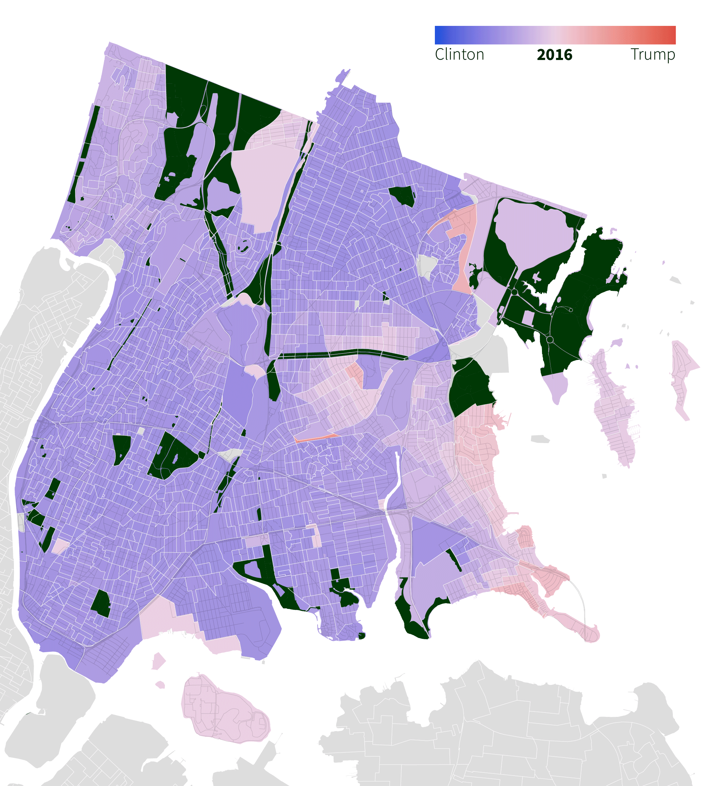

# U.S. Elections (official election night results)

This is a companion repository to [us-elex-2024-bx](https://github.com/cmgsalazar/us-elex-2024-bx), which mapped *unofficial* 2024 election night results in the Bronx, at election district level. 

For a more thorough insight on how Bronxites vote, I looked at data from the 2016 and 2020 elections. While this repository filters data for the presidential race and specifically in the Bronx, the lines of code may be adjusted to cater to other positions and coverage areas. 

Resulting analysis will be used for a reporting assignment for the [Mott Haven Herald](https://motthavenherald.com/) and [Hunts Point Express](https://huntspointexpress.com/). 

This is part of our class requirement for Craft of Journalism (South Bronx) at the Craig Newmark Graduate School of Journalism at CUNY, under the instruction of Eileen Markey and Ben Fractenberg and the editorship of Joe Hirsch.



## Data sources

* Vote counts per election district from [New York City Board of Elections](https://vote.nyc/page/election-results-summary)
* Election district coordinates from [NYC Department of City Planning](https://www.nyc.gov/site/planning/data-maps/open-data/districts-download-metadata.page) (H/T [toddwschneider](https://github.com/toddwschneider/nyc-presidential-election-map))
* Parks shapefiles from [NYC Open Data](https://nycopendata.socrata.com/Recreation/Parks-Properties/enfh-gkve/about_data)

**Notes**:

* Boundaries of election districts vary due to redistricting. 
* Shapefiles were processed into JSON through [Mapshaper](https://mapshaper.org/) and QGIS. 

## Content 

```.
├── analysis.ipnyb  	# main notebook used to filter datasets and process vote counts for visualization
├── csv             	# holds processed datasets for visualization
├── images          	# holds image files for webpage
├── data            	# holds raw datasets, downloaded from the NYC BOE website
├── json            	# holds shapefiles and JSON files for visualization
├── refactored-json 	# holds geojson files (merged json and csv data); used for Mapbox 
├── LICENSE
└── README.md
```

## Visualization

Maps were processed through a mix of Datawrapper, QGIS, Mapbox, and Adobe Illustrator and Photoshop. 

### More about the process... 

*Why did I have to use so many tools?* Initially, the assignment was only to map 2024 election night results — hence, this [companion repository](https://github.com/cmgsalazar/us-elex-2024-bx) — for which I tried to simplify my workflow. I ran the `json` and `csv` through Datawrapper, then refined the graph via Illustrator. 

*But then...* Our reporting class decided to compare 2024 data with those of 2016 and 2020. I redid the same process. For the first attempt, I used total vote counts. But, we realized we needed a "fixed" measure of vote differentials for the choropleth map. I decided to re-calculate and plot percentage points instead. 

We also wanted overlays of roads and parks; hence, QGIS and Illustrator. *(Quick shoutout to Hannah Dormido for the guidance!)*

The first prototype page for the visualization utilized drop-down menus and a JavaScript `event listener` that would show static images of the maps. 

However, the class decided to use tooltips and add annotations to show more details per election district per year — which would honestly be too much work for one person *(me!)* to do on a tight timeline. (I thought `ai2html` might work, but I also don't have the expertise to do this yet.)

So, I explored Mapbox as an option. `json` and `csv` files were refactored via QGIS, then uploaded as tilesets on Mapbox. (As a last resort, I was told to use Datawrapper to replace static images on the first version of our prototype page.)

This is, quite obviously, a living repository for now. We'll see what happens next. 